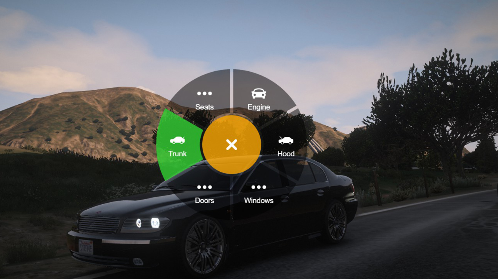
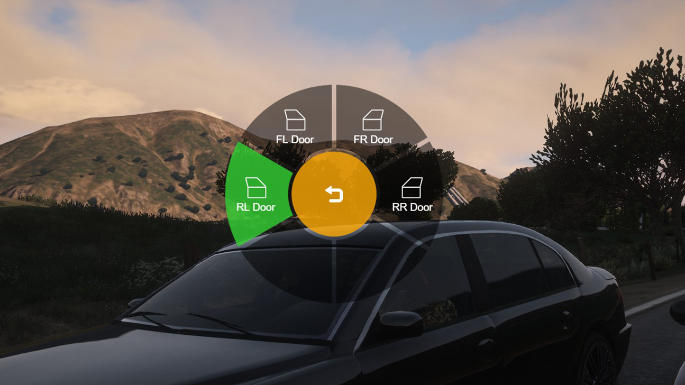
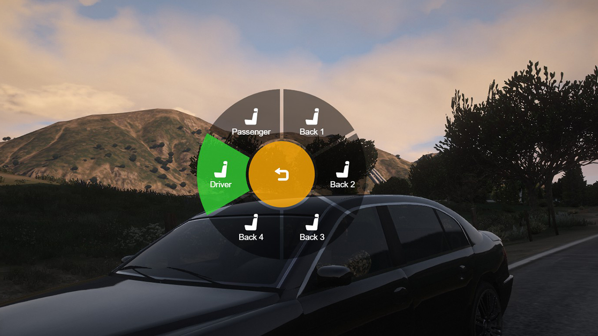
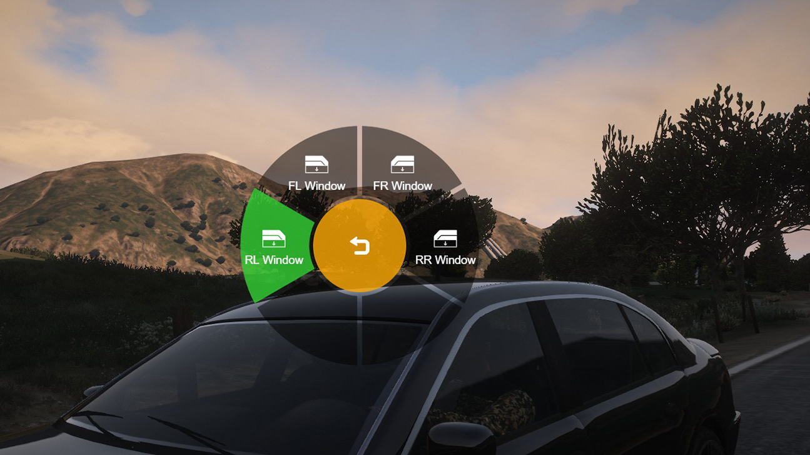

# Hop_ Vehicle Control
FiveM vehicle control commands with a radial menu taken from [Axln - Radial Menu](https://github.com/axln/radial-menu-js)
## Features
- Hood/Trunk Commands
- Door/Window Commands
- Engine on/off Command
- Radial menu using F1 to use commands
- Icons for each fuction
## Images

## Installation
- Place hop_vehcontrol in your resources folder.
- Add start hop_vehcontrol to your server.cfg
## License
- Licensed under MIT / Check [LICENSE](/LICENSE) file
